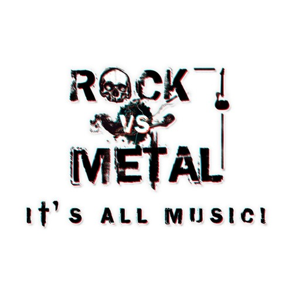

```{r setup, include=FALSE}
knitr::opts_chunk$set(echo = TRUE)
```



\newline
\newline
Rock music is one of the most popular music genre. In the lyric dataset used this time, half songs are rock music. Sometimes, metal music is classified as one certain type of rock music. When people think of rock or metal music, they might expect noise sound and negative lyrics related with violence. Is this idea true? What sililarities and differences do they (rock music and metal music) have?     


```{r, message=FALSE, warning=FALSE, echo=FALSE}
##Load required packages first.

packages.used=c("tm", "wordcloud", "RColorBrewer", 
                "dplyr", "tydytext")

# check packages that need to be installed.
packages.needed=setdiff(packages.used, 
                        intersect(installed.packages()[,1], 
                                  packages.used))
# install additional packages
if(length(packages.needed)>0){
  install.packages(packages.needed, dependencies = TRUE,
                   repos='http://cran.us.r-project.org')
}

library(tm)
library(wordcloud)
library(RColorBrewer)
library(dplyr)
library(tidytext)
library(data.table)
library(tidyverse)
library(DT)
library(sentimentr)
library(syuzhet)
```
In this project, to simplify the process of analysing data and to make lyrics more typical, in each genre, songs published by ten artists who owned the most works are selected for further analysis. 

```{r, echo=FALSE, message=FALSE, warning=FALSE}
load('../output/processed_lyrics.RData')
rock<-dt_lyrics%>%filter(genre=="Rock")
rockart<-rock%>%group_by(artist)%>%summarise(count=n())%>%arrange(desc(count))
rockfamous<-head(rockart,10)%>%pull(artist)
tprock<-rock%>%filter(artist %in% rockfamous)%>%
  mutate(lyricwords=unlist(map(lyrics, function(x) length(unlist(strsplit(x, split = " "))))),
         stemno=unlist(map(stemmedwords, function(x) length(unlist(strsplit(x, split = " "))))),
         ratio=round(lyricwords/stemno,3))

metal<-dt_lyrics%>%filter(genre=="Metal")
metalart<-metal%>%group_by(artist)%>%summarise(count=n())%>%arrange(desc(count))
metalfamous<-head(metalart,10)%>%pull(artist)
tpmetal<-metal%>%filter(artist %in% metalfamous)%>%
  mutate(lyricwords=unlist(map(lyrics, function(x) length(unlist(strsplit(x, split = " "))))),
         stemno=unlist(map(stemmedwords, function(x) length(unlist(strsplit(x, split = " "))))), 
         ratio=round(lyricwords/stemno,3))
```
Let's see who are representative artists in rock music. 
```{r echo=FALSE}
rockfamous
```
What about metal music?
```{r, echo=FALSE}
metalfamous
```

It seems, at least for me, rock artists are more well-known than metal singers. Next, I will explore rock music and metal music in deep. 

## Composition of lyrics

Lyrics of songs are made up of a few stem words. Some certain genre of music prefers keeping repeating same words while some does not. What about rock and metal? What is the composition of their lyrics? A boxplot of ratio which is the number of words in lyrics over the number of stem words is drawn to explore the composition of rock lyrics and metal lyrics. Acoording to the boxplot, the ratio of rock musci is higher than that of metal. I would say rock music uses more abundant words than metal. In other word, metal lyrics prefer repeating words.    
```{r echo=FALSE, message=FALSE, warning=FALSE}
library(shiny)
library(plotly)
div(plot_ly(type = "box")%>%
      add_boxplot(y=tprock$ratio,
                  marker = list(color='orange', alpha=0.5),
                  line=list(color='orange', alpha=0.5),
                  name='ROCK')%>%
      add_boxplot(y=tpmetal$ratio,
                  marker=list(color='blue',alpha=0.5),
                  line=list(color='blue', alpha=0.5),
                  name='METAL'),
    align='center')

```


## What do the songs sing about?  

Do artists in rock music and metal music really focus on violence, blood and other extreme sences? In this part, by using *wordcloud* package, I figured out words that appear most frequently in rock and metal music. 
```{r, echo=FALSE, message=FALSE, warning=FALSE}
corpust1<-VCorpus(VectorSource(tprock$stemmedwords))
word_tibblet1 <- tidy(corpust1) %>%
  select(text)%>%
  unnest_tokens(word, text)%>%
  group_by(word)%>%
  summarise(number=n())
wordcloud(word_tibblet1$word, word_tibblet1$number,
          scale=c(5,0.5),
          max.words=100,
          min.freq=1,
          random.order=FALSE,
          rot.per=0.3,
          use.r.layout=T,
          random.color=FALSE,
          colors=brewer.pal(9,"Oranges"))
corpust2<-VCorpus(VectorSource(tpmetal$stemmedwords))
word_tibblet2 <- tidy(corpust2) %>%
  select(text)%>%
  unnest_tokens(word, text)%>%
  group_by(word)%>%
  summarise(number=n())
wordcloud(word_tibblet2$word, word_tibblet2$number,
          scale=c(5,0.5),
          max.words=100,
          min.freq=1,
          random.order=FALSE,
          rot.per=0.3,
          use.r.layout=T,
          random.color=FALSE,
          colors=brewer.pal(9,"Blues"), main="METAL")

```

The orange word cloud showed that **love, time, baby and youre** mentioned most frequently by rock musicians. The blue one is the word cloud for metal music and we can see that **time, life, world, and live** appear a lot. According to word clouds, both two music genres sing about **time**. While rock musicians are more romantic because their lyrics talk more about **love, heart and baby**. Metal singers sing about their life and their lyrics contain darker words such as **blood, death, hell and kill**.  


## What emotions they express?
Word clouds in the previous session indicated that lyrics of metal music contain darker words, so is it true that metal music deliver more negative emotions? We use same color theme as movie "Inside Out". 
```{r, echo=FALSE, warning=FALSE, message=FALSE}

##Since it spends nearly 30 minutes to generate the following dataset "senten.celist", this dataset was stored in file "output" and computation codes can be found in file "doc".  

load("../output/sentencelist.RData")
sentimentplot<-function(In.list, Genre){
  
  #"anger"     "anticipation"          "disgust"     "fear"       
  #"joy"        "sadness"      "surprise"         "trust"
  
  col.use=c("light grey", "red2", "darkgoldenrod1", "chartreuse3", "blueviolet",
            "darkgoldenrod1", "dodgerblue3", "darkgoldenrod1","darkgoldenrod1")
  
  In.list$topemotion=apply(select(In.list, 
                                    anger:trust), 
                                 1, which.max)
  In.list$topemotion.v=apply(select(In.list,
                                    anger:trust), 
                                   1, max)
  In.list$topemotion[In.list$topemotion.v<0.01]=0
  In.list$topemotion=In.list$topemotion+1
  
  temp=In.list$topemotion.v
  In.list$topemotion.v[temp<0.05]=1
  
  df=In.list%>%
    filter(genre==Genre)%>%
    select(sent.id, word.count, 
           topemotion, topemotion.v)
  
  ptcol.use=alpha(col.use[df$topemotion], sqrt(sqrt(df$topemotion.v)))
  
  plot(df$sent.id, df$word.count,
       xlab="", ylab="",
       col=ptcol.use,
       type="h",
       main=Genre)
}


sentimentplot(sentence.list, "Rock")
sentimentplot(sentence.list,"Metal")

for(i in c("Rock", "Metal")){
  emo.means=colMeans(select(sentence.list%>%filter(genre==i), anger:trust)>0.01)
col.use=c("red2", "darkgoldenrod1", "chartreuse3", "blueviolet",
            "darkgoldenrod1", "dodgerblue3", "darkgoldenrod1","darkgoldenrod1")
barplot(emo.means[order(emo.means)], las=2, col=col.use[order(emo.means)], horiz=T, main=i)
}
```


From sentiment plots, it is easy to find out that both rock music and metal songs express colorful emotions by lyrics. There are more darkgoldenrod bars, which represent emotions of anticipation, joy, surprise and trust, in rock music, so rock musicians are more likely to show positive feelings. While for metal music, the top three emotions it expresses are fear, sadness and anger. This result matches what we see from word clouds, and lyrics in metal music do show more negative emotions than rock. 


## Summary 
By conducting above analysis, the following conclusions are drawn. 

+ Lyrics of rock music are derived from richer stem words and rock lyrics repeated words less in one single song.  

+ Both rock and metal music focus on the word **time**. Lyrics of rock music are more positive and romantic and they sing about **love, baby and heart**. Metal music mentions dark words which deliver negative emotions such as **death, hell and kill** more frequently. 
